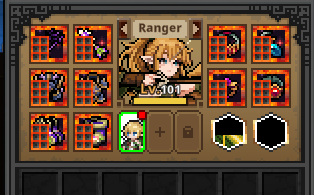
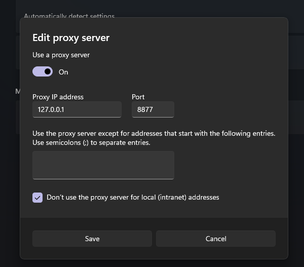
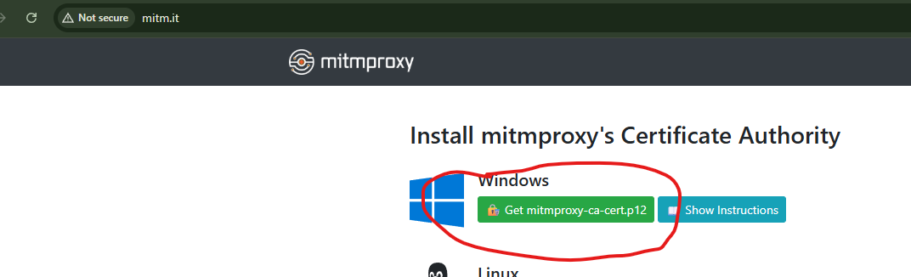

# TBH Item Generator

  


This Code is not Mine - Credits To The Owner

## Recommend
- Use a secondary (dummy) account, as this may result in a ban if detected.
- If you choose to use your main account, you do so at your own risk.
- It is recommended to collect all chests first, then use the generator to obtain items in a single session.
- Do not sell, synthesize, or craft generated items or gear. Use them as equipment only.


## Requirements

- Python 3.10 or newer
- All files in this repository folder kept together

## Setup

1. Install Python 3.10 or newer.
2. Keep all project files in the same folder.
3. Run:

   ```bat
   requirements.bat
   ```

4. Run:

   ```bat
   self_test.bat
   ```

   Make sure it prints:

   ```text
   Self-test OK.
   ```

5. Run:

   ```bat
   run_proxy.bat
   ```

6. Set the Windows HTTP and HTTPS proxy to:

   ```text
   127.0.0.1:8877
   ```

   

7. Keep the proxy running, then open this in a browser and click the Windows certificate:

   ```text
   http://mitm.it
   ```


8. After the first proxy start, the certificate is available at:

   ```text
   %USERPROFILE%\.mitmproxy\mitmproxy-ca-cert.cer
   ```

9. Install the certificate into:

   ```text
   Trusted Root Certification Authorities
   ```
## Gear ID
- You can replace it with other gear IDs in `config.json`.
- Item IDs can be found on the game wiki.
- https://taskbarhero.wiki/gear


Change only the Gear IDs below to the gear you want.

  "range_replacement": {
    "enabled": true,
    "name": "Range replacement",
    "match_min_item_id": 500000,
    "match_max_item_id": 950000,
    "replacement_reward_item_ids": [
"Add the gear ids you want here"
    ]
  }
}

Sample:


10. Start the game and trigger the box reward request.
11. When finished, disable the Windows proxy.


## Files

- `config.json`
- `requirements.txt`
- `requirements.bat`
- `run_proxy.bat`
- `run_proxy.py`
- `self_test.bat`
- `tbh_reward_hook.py`
